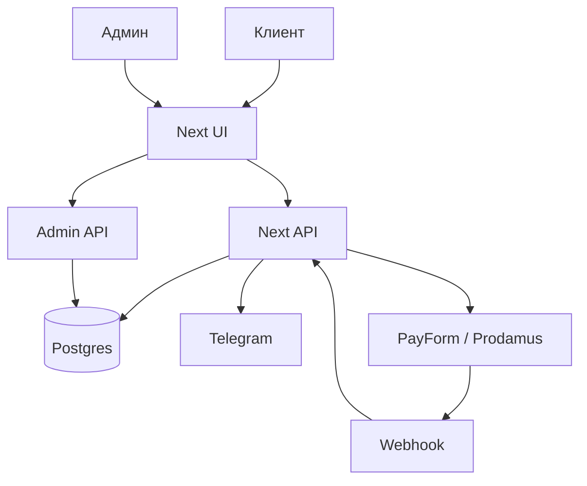

# План проекта starvedas.ru

## 1. Цель проекта

`starvedas.ru` должен стать клиентским сайтом для продажи ягий, пудж, абхишек и связанных церемоний.

Главная задача сайта: быстро объяснить ценность участия, вызвать доверие, провести клиента по понятной записи и безопасно довести до оплаты.

## 2. Основная концепция

- [ ] Сделать сайт с фокусом на клиента, а не на внутреннюю структуру проекта.
- [ ] На первом экране разместить вовлекающий слоган и понятный призыв к действию.
- [ ] Основные действия на главной странице:
  - [ ] `Расписание`
  - [ ] `Записаться`
- [ ] Сайт должен работать как единое приложение на `Next.js`.
- [ ] Backend должен быть внутри Next.js, без отдельного backend-сервиса.
- [ ] Приложение должно быть упаковано в Docker.
- [ ] Развертывание выполнить через Dokploy Server на VPS.

## 3. Техническое решение

### 3.1 Стек

- [x] Frontend: `Next.js`, `React`, `TypeScript`. Готово: создан базовый Next.js проект с App Router и TypeScript.
- [x] Backend: `Next.js Route Handlers` или `Server Actions`. Готово: добавлен первый Route Handler `/api/health`; бизнес-API будет расширяться дальше.
- [x] UI: адаптивная верстка для телефона, планшета и компьютера. Готово: главная страница получила responsive CSS для мобильного, планшета и desktop.
- [ ] База данных: `PostgreSQL` в Docker окружении.
- [ ] ORM: `Prisma` или другой выбранный ORM после старта разработки.
- [x] Валидация данных: `zod` или аналогичная библиотека. Готово: `zod` добавлен в зависимости, схемы формы будут реализованы на этапе формы заказа.
- [x] Деплой: `Docker` + `Dokploy`. Готово частично: добавлены Dockerfile и docker-compose; настройка Dokploy на VPS остается отдельным этапом.
- [ ] Хостинг: VPS.

### 3.2 VPS и деплой

- [ ] VPS host: `8d5c6a4b6bf9.vps.myjino.ru`.
- [ ] SSH port: `22`.
- [ ] Доступы к VPS хранить только в менеджере паролей или секретах Dokploy.
- [ ] Пароль от VPS не записывать в репозиторий, `plan.md`, README, задачи, логи и скриншоты.
- [ ] В Dokploy создать приложение `starvedas`.
- [ ] Настроить домен `starvedas.ru`.
- [ ] Настроить HTTPS через Let's Encrypt.
- [ ] Настроить переменные окружения через Dokploy secrets/env.

### 3.3 Общая архитектура



Пояснение:

- `Next UI` отвечает за страницы, формы и клиентский интерфейс.
- `Next API` принимает заявки, создает заказы, отправляет Telegram уведомления и готовит платеж.
- `Postgres` хранит расписание, кураторов, услуги, заказы и статусы оплаты.
- `PayForm` или `Prodamus` принимает оплату.
- `Webhook` подтверждает статус оплаты на backend.
- `Admin API` позволяет менять расписание, услуги, цены и просматривать заявки.

## 4. Структура сайта

### 4.1 Главная страница

- [ ] Первый экран:
  - [ ] сильный заголовок;
  - [ ] короткий подзаголовок;
  - [ ] кнопка `Записаться`;
  - [ ] кнопка `Расписание`;
  - [ ] блок доверия: опыт, традиция, кураторы, понятная оплата.
- [ ] Блок "Что можно заказать":
  - [ ] ягья;
  - [ ] пуджа;
  - [ ] абхишека;
  - [ ] марафон;
  - [ ] Шраддха ягья;
  - [ ] абонемент на месяц.
- [ ] Блок "Как проходит участие":
  - [ ] выбрать куратора;
  - [ ] выбрать церемонию;
  - [ ] указать участников;
  - [ ] оплатить;
  - [ ] получить подтверждение.
- [ ] Блок кураторов.
- [ ] Блок расписания.
- [ ] Блок вопросов и ответов.
- [ ] Подвал с юридическими ссылками.

### 4.2 Страница или модальное окно "Расписание"

- [x] Сделать кнопку `Расписание`. Готово: CTA и ссылка в навигации ведут к блоку расписания.
- [x] Текст расписания должен редактироваться ежемесячно. Готово: добавлена страница `/admin/schedule`.
- [x] В первой версии расписание можно хранить в базе и менять через админку. Готово: главная берет активное расписание из `Schedule`.
- [x] В админке добавить поле:
  - [x] месяц;
  - [x] заголовок;
  - [x] текст расписания;
  - [x] активность публикации.

### 4.3 Страница или модальное окно "Записаться"

- [ ] После клика на `Записаться` открыть пошаговую форму.
- [ ] Шаг 1: выбор куратора.
- [ ] Шаг 2: выбор церемонии.
- [ ] Шаг 3: количество участников и список участников.
- [ ] Шаг 4: контактные данные клиента.
- [ ] Шаг 5: проверка заказа.
- [ ] Шаг 6: кнопка `Оплатить заказ`.

## 5. Кураторы

Добавить выбор куратора:

- [ ] Джая Мангал
- [ ] Артем Мещеряков
- [ ] Альфия Полесская
- [ ] Кхандита дд
- [ ] Елена Иневатова
- [ ] Анжелика Иневатова
- [ ] Кристина Сахута
- [ ] Радхика Кешави
- [ ] Гауранга Дас
- [ ] Фарида Лансарова
- [ ] Оджасви Гопи дд

Для каждого куратора в базе предусмотреть:

- [ ] имя;
- [ ] активен или скрыт;
- [ ] порядок сортировки;
- [ ] описание, если понадобится;
- [ ] фото, если понадобится.

## 6. Услуги и цены

### 6.1 Список церемоний по умолчани. с возможность редактировать

- [ ] `6000 руб.` Абонемент на месяц.
- [ ] `2500 руб.` Марафон.
- [ ] `3500 руб.` Марафон.
- [ ] `4500 руб.` Марафон.
- [ ] `1200 руб.` Один обряд.
- [ ] `1000 руб.` Абхишека.
- [ ] `250 руб.` Шраддха за одно имя из списка.

### 6.2 Правила для выбора участников

Для каждой услуги добавить:

- [ ] кнопку или контрол выбора количества участников;
- [ ] поле `Список участников`;
- [ ] подсказку внутри поля:

```text
Список участников (каждый на новой строке)
Если вы заказываете несколько мест на абонемент, марафон или Шраддха Ягью, то добавьте всех участников в это поле
```

- [ ] Проверять, что количество участников совпадает со списком, если услуга требует точный список.
- [ ] Для Шраддха считать стоимость по количеству имен.
- [ ] Для услуг с фиксированной ценой за участника считать итоговую сумму на backend.
- [ ] Не доверять цене, пришедшей с frontend.

### 6.3 Что нужно уточнить перед реализацией цен

- [ ] Марафоны за `2500`, `3500`, `4500` должны иметь разные названия или описания.
- [ ] Нужно определить, все ли цены умножаются на количество участников.
- [ ] Нужно определить, есть ли скидки, промокоды, абонементы для групп.
- [ ] Нужно определить, нужен ли выбор даты церемонии.

## 7. Форма заказа

### 7.1 Обязательные поля

- [ ] Куратор.
- [ ] Церемония.
- [ ] Количество участников.
- [ ] Список участников.
- [ ] Имя заказчика.
- [ ] Контакт заказчика:
  - [ ] Telegram;
  - [ ] телефон;
  - [ ] email, если нужно письмо.
- [ ] Согласие с политикой обработки персональных данных.

### 7.2 Поведение формы

- [ ] Форма должна быть простой и пошаговой.
- [ ] На каждом шаге показывать только нужные поля.
- [ ] Перед оплатой показать экран подтверждения заказа.
- [ ] После создания заказа показывать сообщение:

```text
Спасибо! Заказ оформлен. Пожалуйста, подождите. Идет переход к оплате...
```

- [ ] После успешной оплаты показать страницу `Оплата прошла успешно`.
- [ ] После ошибки оплаты показать страницу `Оплата не завершена`.
- [ ] Если пользователь закрыл оплату, заказ должен остаться в статусе `Ожидает оплаты`.

## 8. Telegram уведомления

### 8.1 Получатель

- [ ] Уведомления о заказах должны приходить владельцу в Telegram: `https://t.me/art_om108`. Код отправки готов, для проверки нужны `TELEGRAM_BOT_TOKEN`, `TELEGRAM_CHAT_ID` и `TELEGRAM_ALLOWED_USER_IDS`.

### 8.2 Как реализовать

- [ ] Создать Telegram bot через BotFather.
- [ ] Получить `TELEGRAM_BOT_TOKEN`.
- [ ] Получить `TELEGRAM_CHAT_ID` для получателя или группы.
- [ ] Получить `TELEGRAM_ALLOWED_USER_IDS` пользователей, которым будет доступен бот. Несколько id указывать через запятую, например `123456789,987654321`.
- [x] Хранить токен, chat id и allowed user ids только в переменных окружения. Готово: отправка читает только `TELEGRAM_BOT_TOKEN` и `TELEGRAM_CHAT_ID`, доступ к будущим bot-командам заложен через `TELEGRAM_ALLOWED_USER_IDS`, в `.env.example` оставлены пустые шаблоны.
- [x] При создании заказа отправлять сообщение в Telegram. Готово: после создания заказа `/api/orders` отправляет уведомление владельцу, если заданы Telegram env-переменные.
- [ ] При успешной оплате отправлять отдельное сообщение или обновлять статус в новом сообщении.

### 8.3 Пример содержания уведомления

```text
Новый заказ StarVedas

Заказ: #123
Статус: ожидает оплаты
Куратор: Джая Мангал
Церемония: Абонемент на месяц
Сумма: 6000 руб.
Участников: 1
Список участников:
Иван Иванов

Заказчик: Иван
Telegram: @username
Телефон: +7...
```

## 9. Платежные системы PayForm и Prodamus

### 9.1 Приоритетная система

- [x] Приоритетная платежная система: `http://chintamanidhama.payform.ru`. Готово частично: добавлена как провайдер `payform`, включается и выключается в `/admin/payments`.
- [x] Дополнительная платежная система: `https://prodamus.ru`. Готово частично: добавлена как провайдер `prodamus`, включается и выключается в `/admin/payments`.
- [ ] Перед разработкой интеграции получить официальную документацию PayForm из личного кабинета или у поддержки.
- [ ] Проверить, какие доступны методы оплаты:
  - [ ] банковские карты;
  - [ ] СБП;
  - [ ] SberPay;
  - [ ] T-Pay;
  - [ ] Альфа Pay;
  - [ ] оплата по частям, если включена в кабинете.

### 9.2 Ожидаемый сценарий интеграции

- [ ] Клиент заполняет форму.
- [ ] Backend создает заказ в базе.
- [ ] Backend рассчитывает сумму.
- [x] Backend формирует платежную ссылку или запрос в выбранную платежную систему. Готово частично: поддержаны `PayForm` и `Prodamus`.
- [ ] Клиент перенаправляется на оплату.
- [x] PayForm или Prodamus отправляет callback/webhook на backend. Готово частично: добавлены `/api/payform/webhook` и `/api/prodamus/webhook`.
- [x] Backend проверяет подпись webhook. Готово частично: добавлена HMAC-проверка по env-секрету.
- [ ] Backend меняет статус заказа на `Оплачен`.
- [ ] Backend отправляет Telegram уведомление об оплате.

### 9.3 Что обязательно проверить в документации PayForm

- [ ] URL API для создания платежа.
- [ ] Формат платежной ссылки.
- [ ] Обязательные поля заказа.
- [ ] Поле для номера заказа.
- [ ] Поле для суммы.
- [ ] Валюта.
- [ ] Формирование подписи.
- [ ] Проверка подписи callback/webhook.
- [ ] URL успешной оплаты.
- [ ] URL ошибки оплаты.
- [ ] URL уведомления о статусе оплаты.
- [ ] Тестовый режим.
- [ ] Возвраты.

### 9.4 Переменные окружения для PayForm и Prodamus

Названия уточнить по документации, но заранее заложить:

- [ ] `PAYFORM_MERCHANT_ID`
- [ ] `PAYFORM_SECRET_KEY`
- [ ] `PAYFORM_API_URL`
- [ ] `PAYFORM_SUCCESS_URL`
- [ ] `PAYFORM_FAIL_URL`
- [ ] `PAYFORM_WEBHOOK_SECRET`
- [x] `PRODAMUS_MERCHANT_ID`
- [x] `PRODAMUS_SECRET_KEY`
- [x] `PRODAMUS_API_URL`
- [x] `PRODAMUS_SUCCESS_URL`
- [x] `PRODAMUS_FAIL_URL`
- [x] `PRODAMUS_WEBHOOK_SECRET`

### 9.5 Что обычно требуют платежные шлюзы на сайте

Чтобы пройти модерацию платежного шлюза в России, на сайте обычно должны быть явно видны юридические и платежные данные.

- [ ] Полное описание услуг: что покупает клиент, что входит в услугу, сроки и формат оказания.
- [ ] Актуальные цены в рублях.
- [ ] Понятная кнопка оплаты и итоговая сумма до перехода в платежную систему.
- [x] Логотипы и названия доступных способов оплаты. Готово: страницы оплаты показывают карточки способов оплаты с визуальными логотипами, названиями и описаниями; финальный список зависит от PayForm.
  - [x] МИР;
  - [ ] Visa, если поддерживается платежной системой;
  - [ ] Mastercard, если поддерживается платежной системой;
  - [x] СБП;
  - [x] SberPay;
  - [x] T-Pay;
  - [x] Альфа Pay;
  - [ ] оплата по частям, если подключена.
- [ ] Текст о безопасной оплате:

```text
Оплата проходит на защищенной странице платежной системы. Сайт не хранит данные банковских карт.
```

- [ ] Страница `Оплата` с описанием процесса оплаты.
- [ ] Страница `Возврат` с условиями отмены заказа и возврата денег.
- [ ] Страница `Контакты` с реальными контактами продавца.
- [ ] Ссылки на оферту, политику конфиденциальности и согласие на обработку персональных данных рядом с формой заказа.
- [ ] Чекбокс согласия перед оплатой.
- [ ] HTTPS на всем сайте.
- [ ] Рабочие страницы `Успешная оплата` и `Ошибка оплаты`.
- [ ] Нельзя обещать гарантированный результат духовной практики, лучше описывать услугу как организацию участия в церемонии.

### 9.6 Данные ИП или организации для модерации

Данные продавца должны редактироваться в админке, чтобы не менять код при изменении реквизитов.

- [x] В админке создать раздел `Настройки организации`. Готово: добавлена страница `/admin/organization`.
- [ ] Добавить редактируемые поля:
  - [x] тип продавца: `ИП`, `ООО`, самозанятый или другой вариант;
  - [x] полное наименование;
  - [x] ФИО ИП или руководителя;
  - [x] ИНН;
  - [x] ОГРНИП или ОГРН;
  - [x] юридический адрес;
  - [x] почтовый адрес, если отличается;
  - [x] email для клиентов;
  - [x] телефон для клиентов;
  - [x] Telegram или другой официальный канал связи;
  - [x] режим работы поддержки;
  - [x] банковские реквизиты, если их нужно показывать в оферте;
  - [x] название платежного получателя, которое увидит клиент;
  - [x] реквизиты онлайн-кассы, если применимо.
- [x] Использовать эти данные автоматически в подвале сайта, оферте, политике, контактах и письмах. Готово частично: данные подтягиваются из базы в подвал, контакты, оферту, политику, согласие и возврат; письма будут подключаться при появлении email-уведомлений.
- [ ] Не показывать банковские или налоговые данные, которые не должны быть публичными.

### 9.7 Российские требования для приема оплат

Перед боевым запуском проверить с бухгалтером, юристом и платежным провайдером:

- [ ] Нужна ли онлайн-касса по 54-ФЗ.
- [ ] Как правильно указывать НДС: без НДС, 0%, 10%, 20% или другой режим.
- [ ] Можно ли принимать оплату за выбранные услуги по текущему ОКВЭД.
- [ ] Нет ли ограничений платежного шлюза на религиозные, эзотерические или благотворительные формулировки.
- [ ] Нужна ли маркировка как пожертвование или как услуга, если применимо.
- [ ] Как оформлять возвраты и частичные возвраты.
- [ ] Как хранить персональные данные по 152-ФЗ.
- [ ] Нужно ли уведомление Роскомнадзора об обработке персональных данных.
- [ ] Какие документы платежный шлюз запросит для KYC/модерации.

### 9.8 Чеклист модерации платежного шлюза

- [ ] Сайт открывается без ошибок.
- [ ] Домен подключен и работает по HTTPS.
- [ ] На сайте есть понятное описание деятельности.
- [ ] На сайте есть цены.
- [ ] На сайте есть контакты продавца.
- [ ] На сайте есть данные ИП или организации.
- [ ] На сайте есть оферта.
- [ ] На сайте есть политика конфиденциальности.
- [ ] На сайте есть согласие на обработку персональных данных.
- [ ] На сайте есть условия оплаты.
- [ ] На сайте есть условия возврата.
- [ ] На сайте есть способы оплаты с логотипами.
- [ ] На сайте нет тестовых текстов и пустых страниц.
- [ ] Корзина или форма заказа показывает итоговую сумму до оплаты.
- [ ] Платежная кнопка ведет на корректную платежную страницу.
- [ ] После оплаты есть понятный возврат на сайт.
- [ ] Все юридические данные совпадают с данными в кабинете платежной системы.

## 10. Админка

### 10.1 Минимальная админка

- [ ] Вход по логину и паролю.
- [ ] Управление расписанием.
- [ ] Управление кураторами.
- [ ] Управление услугами и ценами.
- [ ] Просмотр заказов.
- [ ] Ручное изменение статуса заказа, если потребуется.

### 10.2 Роли доступа

- [ ] `SuperAdmin` - полный доступ ко всему проекту.
- [ ] `Admin` или `Manager` - операционное управление заявками, расписанием и контентом без доступа к критическим настройкам.
- [ ] `Curator` - личная CRM куратора, работа только со своими клиентами и заявками.
- [ ] `Client` - клиентский кабинет, если будет нужен во второй версии.

### 10.3 Супер-администратор

Супер-администратор должен видеть и управлять всей системой.

- [ ] Менять тарифы, цены, названия и описания церемоний.
- [ ] Добавлять, редактировать, скрывать и удалять кураторов.
- [ ] Назначать кураторам роли и права доступа.
- [ ] Видеть все заявки по всем кураторам.
- [ ] Видеть работу каждого куратора:
  - [ ] количество новых заявок;
  - [ ] количество принятых заявок;
  - [ ] количество оплаченных заказов;
  - [ ] сумма оплат по куратору;
  - [ ] конверсия из заявки в оплату;
  - [ ] среднее время первого ответа;
  - [ ] просроченные заявки;
  - [ ] отмененные или потерянные заявки.
- [ ] Назначать заявку другому куратору.
- [ ] Смотреть историю изменений по заказу.
- [ ] Смотреть переписку куратора с клиентом для контроля качества.
- [ ] Управлять расписанием.
- [ ] Управлять юридическими страницами.
- [ ] Управлять платежными настройками без показа секретных ключей в интерфейсе.
- [ ] Управлять данными ИП или организации для оферты, контактов и модерации платежей.
- [ ] Управлять списком способов оплаты и их отображением на сайте.
- [ ] Экспортировать заказы в CSV или XLSX.
- [ ] Фильтровать заказы по дате, куратору, услуге, статусу и оплате.
- [ ] Видеть финансовую сводку:
  - [ ] оборот за период;
  - [ ] оплаченные заказы;
  - [ ] ожидающие оплаты;
  - [ ] возвраты;
  - [ ] популярные услуги;
  - [ ] эффективность кураторов.

### 10.4 CRM для кураторов

У каждого куратора должен быть свой кабинет CRM.

- [ ] Куратор видит только свои заявки и клиентов.
- [ ] Куратор может принять заявку в работу.
- [ ] Куратор может менять статус заявки в рамках своих прав.
- [ ] Куратор может писать внутренние заметки по клиенту.
- [ ] Куратор может видеть историю заказов клиента.
- [ ] Куратор может видеть список участников по каждому заказу.
- [ ] Куратор может добавлять задачи и напоминания:
  - [ ] написать клиенту;
  - [ ] уточнить данные;
  - [ ] напомнить об оплате;
  - [ ] подтвердить участие;
  - [ ] связаться после церемонии.
- [ ] Куратор может использовать шаблоны быстрых ответов.
- [ ] Куратор получает уведомления о новых заявках.
- [ ] Куратор видит свои показатели:
  - [ ] новые заявки;
  - [ ] заявки в работе;
  - [ ] оплаченные заказы;
  - [ ] ожидающие оплаты;
  - [ ] просроченные ответы.

### 10.5 Воронка заявок в CRM

Для работы кураторов добавить статусы:

- [ ] `new` - новая заявка.
- [ ] `assigned` - назначена куратору.
- [ ] `in_work` - куратор взял в работу.
- [ ] `waiting_client` - ждем ответ клиента.
- [ ] `waiting_payment` - ждем оплату.
- [ ] `paid` - заказ оплачен.
- [ ] `completed` - работа завершена.
- [ ] `lost` - клиент не оплатил или отказался.
- [ ] `cancelled` - заявка отменена.

### 10.6 Внутренний чат клиент-куратор

- [ ] Сделать чат внутри сайта между клиентом и куратором.
- [ ] Чат должен быть привязан к клиенту и заказу.
- [ ] Куратор должен видеть переписку в своей CRM.
- [ ] Супер-администратор должен иметь доступ к переписке для контроля качества и спорных ситуаций.
- [ ] Клиент должен получать уведомления о новых сообщениях, например через email или Telegram, если он дал контакт.
- [ ] В чате предусмотреть:
  - [ ] текстовые сообщения;
  - [ ] быстрые шаблоны ответов;
  - [ ] статус прочтения;
  - [ ] историю сообщений;
  - [ ] защиту от спама;
  - [ ] запрет отправки секретных данных и платежных реквизитов в открытом виде.
- [ ] В первой версии можно сделать простой чат без WebSocket, с периодическим обновлением.
- [ ] Во второй версии можно добавить realtime через WebSocket или managed-сервис.

### 10.7 Дополнительные идеи для админки и CRM

- [ ] Карточка клиента с историей всех заказов и обращений.
- [ ] Теги клиентов: новый, постоянный, VIP, нужен ответ, проблема с оплатой.
- [ ] Источник заявки: сайт, Telegram, рекомендация, реклама.
- [ ] Комментарии администратора к работе куратора.
- [ ] Автоматические напоминания клиенту об оплате.
- [ ] Автоматическое сообщение после оплаты.
- [ ] Автоматическое сообщение после завершения церемонии.
- [ ] Календарь церемоний и задач куратора.
- [ ] Шаблоны сообщений для кураторов.
- [ ] Черный список спама и дублей.
- [ ] Объединение дублей клиентов по телефону, Telegram или email.
- [ ] Система качества: оценка работы куратора клиентом после заказа.
- [ ] Отчет по повторным заказам.
- [ ] Отчет по самым популярным церемониям.
- [ ] Уведомления супер-администратору о просроченных заявках.
- [ ] Журнал действий пользователей админки.
- [ ] Резервное копирование заказов и сообщений.

### 10.8 Защита админки и CRM

- [ ] Админка не должна быть публично индексируемой.
- [ ] Пароли хранить только в виде хеша.
- [ ] Добавить rate limit на вход.
- [ ] Не показывать секреты в интерфейсе.
- [ ] Логи админки не должны содержать токены и пароли.
- [ ] Куратор не должен видеть заявки других кураторов.
- [ ] Любое действие с заказом должно сохраняться в журнале.
- [ ] Доступ к переписке должен быть защищен авторизацией.
- [ ] Экспорт данных должен быть доступен только супер-администратору.
- [ ] Персональные данные нельзя отправлять во внешние сервисы без необходимости и согласия.

## 11. База данных

### 11.1 Основные сущности

- [ ] `Curator` - кураторы.
- [ ] `Service` - услуги и цены.
- [ ] `Schedule` - расписание.
- [ ] `Order` - заказ.
- [ ] `OrderParticipant` - участники заказа.
- [ ] `Payment` - платежи и статусы.
- [ ] `AdminUser` - администраторы.
- [ ] `User` - пользователи системы.
- [ ] `Role` - роли доступа.
- [ ] `ClientProfile` - карточка клиента.
- [ ] `CuratorProfile` - профиль куратора.
- [ ] `LeadStatusHistory` - история статусов заявки.
- [ ] `Task` - задачи и напоминания куратора.
- [ ] `ChatThread` - чат по клиенту или заказу.
- [ ] `ChatMessage` - сообщения в чате.
- [ ] `MessageTemplate` - шаблоны быстрых ответов.
- [ ] `AuditLog` - журнал действий админки и CRM.
- [ ] `ClientTag` - теги клиентов.
- [ ] `OrganizationSettings` - данные ИП или организации.
- [x] `PaymentMethod` - способы оплаты и логотипы. Готово: модель есть, seed содержит способы оплаты и описания, публичные страницы читают активные способы из базы.
- [ ] `LegalDocument` - юридические документы и версии.

### 11.2 Статусы заказа

- [ ] `draft` - создан на форме, но не подтвержден.
- [ ] `pending_payment` - ожидает оплаты.
- [ ] `paid` - оплачен.
- [ ] `failed` - ошибка оплаты.
- [ ] `cancelled` - отменен.
- [ ] `refunded` - возвращен.

## 12. Юридические документы

### 12.1 Документы на сайте

- [ ] Политика конфиденциальности.
- [ ] Согласие на обработку персональных данных.
- [ ] Публичная оферта.
- [ ] Условия оплаты.
- [ ] Условия возврата.
- [ ] Контакты организации или исполнителя.
- [ ] Страница с доступными способами оплаты.
- [ ] Страница о безопасности платежей.

### 12.2 Источники

- [ ] Взять актуальную информацию со старого сайта `https://starvedas.ru/`.
- [ ] Особенно проверить политику конфиденциальности и документы по персональным данным.
- [ ] Если автоматическая выгрузка сайта не дает текста, перенести документы вручную из браузера или админки старого сайта.
- [ ] Не копировать документы конкурентов напрямую.
- [ ] Перед публикацией юридические документы должен проверить ответственный человек или юрист.

## 13. Референсы и конкурент

Из референса можно взять идеи, но нельзя копировать дизайн и тексты напрямую.

- [ ] Использовать идею простой заявки в модальном окне.
- [ ] Использовать понятное сообщение после оформления заказа.
- [ ] Использовать быстрый переход к оплате.
- [ ] Сделать платежный экран понятным и безопасным.
- [ ] Не использовать чужие изображения, шрифты, тексты и фирменный стиль без прав.

## 14. Этапы разработки

### Этап 1. Подготовка проекта

- [x] Создать Next.js проект. Готово: создан `package.json`, Next.js App Router и базовые файлы приложения.
- [x] Подключить TypeScript. Готово: добавлены `tsconfig.json`, `next-env.d.ts`, строгий режим и alias `@/*`.
- [x] Настроить ESLint и форматирование. Готово: добавлены `eslint.config.mjs`, Prettier, скрипты `lint`, `format`, `format:write`.
- [x] Настроить структуру папок. Готово: добавлены `src/app`, `src/lib`, `src/components`, `src/server`, `prisma`, `public`.
- [x] Добавить `.env.example` без реальных секретов. Готово: добавлены только шаблоны переменных для базы, Telegram и PayForm.
- [x] Добавить Dockerfile. Готово: добавлен production Dockerfile с `next.config.ts` в режиме `standalone`.
- [x] Добавить docker-compose для локального запуска. Готово: добавлены сервисы `app` и `postgres` для локального Docker окружения.

Результат этапа: проект запускается локально и готов к разработке.

### Этап 2. Дизайн и UX

- [x] Подготовить структуру главной страницы. Готово: добавлены hero, услуги, этапы участия, кураторы, расписание, FAQ и подвал.
- [x] Подготовить тексты первого экрана. Готово: добавлены клиентский заголовок, подзаголовок и CTA `Записаться` / `Расписание`.
- [x] Подготовить форму записи. Готово: добавлена пошаговая форма с выбором куратора, церемонии, участников, контактов, проверкой и шагом оплаты.
- [x] Подготовить мобильную версию. Готово: добавлены адаптивные сетки и мобильные правила для главной страницы и формы.
- [x] Подготовить страницы успешной и неуспешной оплаты. Готово: добавлены `/payment/success` и `/payment/fail`.
- [x] ШРИФТ ST-Nizhegorodsky ДЛЯ ЗАГОЛОВКОВ src\lib\ST-Nizhegorodsky.zip. Готово: шрифт извлечен в `public/fonts` и подключен через `@font-face` для заголовков.
- [x] найти место куда вписать на гланой . Наш Брахман «Последние 10 лет он полностью посвятил себя распространению знаний Бхагавад-Гиты и проведению Ягий. Ему помогают брахманы из его семьи и Джай Мангал дас, русскоязычный брахман, проповедник, преданный, вайшнав.» и фото его src\lib\ygina-1024x690.avif. Готово: блок добавлен на главную после этапов участия, фото скопировано в `public/images/brahman.avif`.
- [x] где фото public/images/brahman.avif вставть внутрь видео `src\lib\2022-06-03-17.38.47.webm` фото будет как превью ну и знак по середине вопроизвести. Готово: видео скопировано в `public/videos/brahman.webm`, фото используется как `poster`, поверх добавлена кнопка воспроизведения по центру.
- [x] Контакты и правовую информацию из `plan.md` добавить на сайт, а перед оплатой или регистрацией добавить галочку согласия со ссылкой на документы. Готово: юридические страницы и контакты добавлены, галочка согласия есть в форме, данные организации теперь редактируются в админке.
 - [] сделать сайт мультиязычный `i18next`  добавить английский и хинди  а также переключение языков админка тоже

Результат этапа: понятный пользовательский путь от главной страницы до оплаты.

### Этап 3. База данных и модели

- [x] Поднять PostgreSQL. Готово: после запуска Docker выполнено `docker compose up -d postgres`.
- [x] Настроить ORM. Готово: добавлены Prisma `6.19.3`, `prisma.config.ts`, `schema.prisma`, Prisma Client и npm-скрипты.
- [x] Создать модели кураторов, услуг, расписания, заказов и платежей. Готово: добавлены `Curator`, `Service`, `Schedule`, `Order`, `OrderParticipant`, `Payment` и базовые модели для ролей, юрданных и способов оплаты.
- [x] Добавить seed-данные для кураторов и услуг. Готово: добавлен `prisma/seed.ts` с кураторами, услугами, расписанием-заглушкой и способами оплаты.
- [x] Проверить миграции. Готово: выполнен `npm run db:migrate`, миграция `20260609132000_init` применена к локальному Postgres.

Результат этапа: данные хранятся в базе, услуги и кураторы не зашиты только в коде.

### Этап 4. Форма записи

- [x] Реализовать выбор куратора. Готово: шаг 1 формы использует список кураторов.
- [x] Реализовать выбор церемонии. Готово: шаг 2 формы использует список услуг и цены.
- [x] Реализовать выбор количества участников. Готово: шаг 3 формы содержит числовой ввод.
- [x] Реализовать поле списка участников. Готово: добавлено поле со списком участников по строкам и подсказкой.
- [x] Реализовать контактные поля. Готово: добавлены имя, Telegram, телефон, email и чекбокс согласия.
- [x] Реализовать валидацию. Готово: есть клиентские ограничения и backend-схема `zod` для `/api/orders`.
- [x] Реализовать расчет итоговой суммы на backend. Готово: `/api/orders` считает сумму по цене из базы и не доверяет цене с frontend.

Результат этапа: клиент может создать заказ без оплаты.

### Этап 5. Telegram уведомления

- [ ] Подключить Telegram bot. Блокер: нужны реальные `TELEGRAM_BOT_TOKEN`, `TELEGRAM_CHAT_ID` и `TELEGRAM_ALLOWED_USER_IDS` в env/secrets.
- [x] Настроить отправку уведомления при создании заказа. Готово: добавлен server-helper для Telegram Bot API и подключен к `/api/orders`.
- [ ] Настроить уведомление при успешной оплате.
- [x] Проверить, что персональные данные не попадают в лишние логи. Готово: ошибки Telegram логируются только техническим сообщением без токена, chat id и данных клиента.

Результат этапа: владелец получает уведомления о новых заказах.

### Этап 6. PayForm и Prodamus

- [ ] Получить официальную документацию PayForm и Prodamus.
- [ ] Получить тестовые и боевые ключи.
- [ ] Проверить требования PayForm к модерации сайта.
- [x] Добавить на сайт логотипы и описания способов оплаты. Готово: `/payment` и `/payment/methods` показывают карточки активных способов оплаты с визуальным логотипом и описанием.
- [x] Добавить данные ИП или организации в подвал, контакты и юридические страницы. Готово: публичные страницы берут данные из `OrganizationSettings`.
- [x] Реализовать создание платежа. Готово частично: после создания заказа формируется ссылка PayForm или Prodamus и сохраняется в `Payment.paymentUrl`; финальная проверка ждет тестовые ключи.
- [x] Реализовать переход на оплату. Готово частично: форма записи перенаправляет клиента на ссылку выбранной платежной системы после создания заказа.
- [x] Реализовать success/fail страницы. Готово: добавлены `/payment/success` и `/payment/fail`; привязка к реальному webhook будет проверяться после тестового платежа.
- [x] Реализовать webhook. Готово частично: добавлены `/api/payform/webhook` и `/api/prodamus/webhook`, которые обновляют `Payment` и `Order` по номеру заказа.
- [x] Реализовать проверку подписи. Готово частично: webhook проверяет HMAC-подпись из env-секрета; формат нужно сверить с официальной документацией PayForm/Prodamus.
- [ ] Протестировать успешную оплату.
- [ ] Протестировать ошибку оплаты.
- [ ] Протестировать повторный webhook.

Результат этапа: заказ можно оплатить, а статус оплаты надежно сохраняется.

### Этап 7. Админка

- [ ] Реализовать вход администратора.
- [ ] Реализовать роли `SuperAdmin`, `Admin`, `Curator`.
- [ ] Реализовать супер-админку.
- [x] Реализовать управление расписанием. Готово: добавлена `/admin/schedule` для создания, редактирования и выбора активного расписания.
- [ ] Реализовать управление кураторами.
- [ ] Реализовать управление услугами.
- [ ] Реализовать просмотр заказов.
- [ ] Реализовать аналитику по работе кураторов.
- [ ] Реализовать назначение и переназначение заявок кураторам.
- [ ] Реализовать кабинет CRM для куратора.
- [ ] Реализовать статусы воронки заявок.
- [ ] Реализовать задачи и напоминания для куратора.
- [ ] Реализовать внутренние заметки по клиентам.
- [ ] Реализовать базовый чат клиент-куратор.
- [ ] Реализовать шаблоны быстрых ответов.
- [ ] Реализовать журнал действий.
- [ ] Добавить базовую защиту админки.

Результат этапа: супер-администратор управляет системой, а кураторы работают с клиентами в своей CRM.

### Этап 8. Юридические страницы

- [x] Перенести документы со старого сайта. Готово частично: добавлен `politika.md` и базовые страницы по данным из плана; финальную юридическую сверку оставить ответственному лицу.
- [ ] Проверить актуальность документов. Долг: тексты должны быть проверены ответственным человеком или юристом перед боевыми оплатами.
- [x] Добавить ссылки в подвал. Готово: в подвал добавлены ссылки на политику, согласие, оферту, оплату, способы оплаты, безопасность, возврат и контакты.
- [x] Добавить согласие перед отправкой заявки. Готово: в форме есть обязательная галочка с ссылками на согласие, политику, оплату, оферту и возврат.
- [x] Добавить страницу политики обработки персональных данных. Готово: добавлена `/legal/privacy`.
- [x] Добавить страницу условий оплаты. Готово: добавлена `/payment`.
- [x] Добавить страницу условий возврата. Готово: добавлена `/refund`.
- [x] Добавить страницу контактов с реквизитами ИП или организации. Готово: добавлена `/contacts` с данными исполнителя из `src/lib/legal-content.ts`.
- [x] Добавить страницу способов оплаты и безопасности платежей. Готово: добавлены `/payment/methods` и `/payment/security`.
- [x] Сделать редактирование данных ИП или организации из админки. Готово: добавлена `/admin/organization` и server action сохранения в `OrganizationSettings`.
- [ ] Сверить юридические данные сайта с данными в платежном кабинете.

Результат этапа: сайт готов к сбору персональных данных и приему оплат с точки зрения базовых документов.

### Этап 9. Docker и Dokploy

- [ ] Собрать Docker образ локально.
- [ ] Проверить запуск контейнера.
- [ ] Настроить приложение в Dokploy.
- [ ] Настроить PostgreSQL в Dokploy.
- [ ] Настроить переменные окружения.
- [ ] Настроить домен.
- [ ] Настроить HTTPS.
- [ ] Проверить деплой.

Результат этапа: сайт доступен на VPS через домен.

### Этап 10. Тестирование и приемка

- [ ] Проверить главную страницу.
- [ ] Проверить мобильную версию.
- [ ] Проверить расписание.
- [ ] Проверить создание заказа.
- [ ] Проверить Telegram уведомления.
- [ ] Проверить расчет суммы.
- [ ] Проверить оплату.
- [ ] Проверить webhook.
- [ ] Проверить юридические ссылки.
- [ ] Проверить ошибки формы.
- [ ] Проверить SEO-метаданные.
- [ ] Проверить скорость загрузки.

Результат этапа: сайт готов к запуску.

## 15. Правила разработки, что обязательно делать

- [x] Использовать TypeScript. Готово: проект, форма, API и Prisma seed написаны на TypeScript.
- [x] Проверять все данные с формы на backend. Готово: `/api/orders` валидирует входные данные через `zod`.
- [x] Считать сумму заказа только на backend. Готово: `/api/orders` рассчитывает сумму по цене услуги из базы.
- [x] Хранить секреты только в переменных окружения. Готово: реальные секреты не добавлялись, есть только шаблоны env-переменных.
- [x] Добавлять `.env.example`, но без реальных ключей. Готово: `.env.example` содержит пустые значения для секретов.
- [x] Делать адаптивную верстку с приоритетом мобильных устройств. Готово: главная и форма адаптируются под мобильный экран.
- [x] Делать понятные ошибки формы. Готово: форма показывает предупреждения по контактам и списку участников.
- [x] Проверять подпись платежного webhook. Готово частично: добавлена HMAC-проверка подписи PayForm webhook по env-секрету.
- [x] Делать idempotency для webhook, чтобы повторное уведомление не ломало заказ. Готово частично: повторный webhook не создает повторную историю статуса, если статус заявки не изменился.
- [x] Логировать технические ошибки, но не логировать секреты. Готово: API пишет только общий технический факт ошибки без персональных данных и секретов.
- [ ] Делать резервные копии базы перед важными изменениями.
- [x] Использовать миграции базы данных. Готово частично: создана офлайн SQL миграция Prisma; live применение ждет запущенный Docker daemon.
- [x] Держать услуги, цены, кураторов и расписание в базе или админке. Готово частично: Prisma models и seed готовы; расписание уже редактируется через `/admin/schedule`, остальные разделы админки будут отдельным этапом.
- [x] Перед деплоем запускать lint, typecheck и тесты. Готово для текущей части: выполнены `format`, `lint`, `typecheck`, `build`, `prisma validate`, `npm audit`.
- [ ] Перед подключением боевой оплаты проверить тестовый платеж.
- [ ] Все изменения проверять локально перед деплоем.

## 16. Правила разработки, чего нельзя делать

- [ ] Нельзя писать отдельный backend-сервис, если задачу можно решить внутри Next.js.
- [ ] Нельзя хранить пароль VPS в репозитории.
- [ ] Нельзя хранить Telegram bot token в коде.
- [ ] Нельзя хранить PayForm secret key в коде.
- [ ] Нельзя коммитить `.env`.
- [ ] Нельзя доверять цене, которую прислал frontend.
- [ ] Нельзя менять статус заказа на `paid` без подтверждения от платежной системы.
- [ ] Нельзя принимать webhook без проверки подписи.
- [ ] Нельзя удалять заказы из базы без резервной копии.
- [ ] Нельзя показывать персональные данные в публичных страницах.
- [ ] Нельзя копировать дизайн и тексты конкурентов напрямую.
- [ ] Нельзя запускать боевой платеж без тестирования.
- [ ] Нельзя деплоить приложение с выключенной HTTPS защитой.
- [ ] Нельзя публиковать сайт без политики конфиденциальности и согласия на обработку персональных данных.

## 17. Минимальная версия для первого запуска

В первую рабочую версию должны войти:

- [ ] Главная страница.
- [x] Расписание с возможностью редактирования. Готово: активное расписание хранится в базе и меняется через `/admin/schedule`.
- [ ] Форма записи.
- [ ] Выбор куратора.
- [ ] Выбор церемонии.
- [ ] Количество участников.
- [ ] Список участников.
- [ ] Контактные данные клиента.
- [ ] Создание заказа.
- [ ] Telegram уведомление. Готово частично: код уведомления о новом заказе добавлен, финальная проверка ждет реальные Telegram env/secrets.
- [x] Интеграция PayForm и Prodamus. Готово частично: создание ссылки, выбор провайдера, переход на оплату и webhook добавлены; тестовые платежи и сверка с официальной документацией остаются блокером.
- [x] Отображение способов оплаты и логотипов платежных методов. Готово: добавлены карточки способов оплаты с визуальными логотипами и описаниями.
- [x] Редактируемые данные ИП или организации. Готово: данные меняются через `/admin/organization`.
- [x] Страницы оплаты, возврата, контактов и безопасности платежей. Готово: добавлены страницы `/payment`, `/refund`, `/contacts`, `/payment/security` и `/payment/methods`.
- [ ] Супер-админка для тарифов, кураторов и заказов.
- [ ] CRM куратора для своих заявок.
- [ ] Базовые статусы работы с заявкой.
- [ ] Внутренние заметки по клиенту.
- [ ] Страницы успешной и неуспешной оплаты.
- [ ] Политика конфиденциальности.
- [ ] Docker деплой через Dokploy.

## 18. Вопросы для уточнения

- [ ] Какие точные названия у марафонов за `2500`, `3500`, `4500` рублей?
- [ ] Все ли услуги умножаются на количество участников?
- [ ] Нужно ли выбирать дату церемонии?
- [ ] Нужна ли оплата без выбора куратора?
- [ ] Нужна ли отправка подтверждения клиенту в Telegram или email?
- [ ] Кто будет администратором сайта?
- [ ] Сколько уровней доступа нужно кроме супер-администратора и куратора?
- [ ] Должен ли клиент входить в личный кабинет или чат будет доступен по защищенной ссылке?
- [ ] Нужен ли realtime-чат сразу или достаточно простого чата с обновлением страницы?
- [ ] Какие показатели считать главными для оценки работы кураторов?
- [ ] Можно ли супер-администратору читать все чаты для контроля качества?
- [ ] Какие реквизиты указывать в оферте и политике?
- [ ] Какой юридический статус у продавца: ИП, ООО, самозанятый или другое?
- [ ] Какие ИНН, ОГРНИП/ОГРН, адрес, email и телефон можно публично показывать?
- [ ] Нужна ли онлайн-касса?
- [ ] Какие способы оплаты реально подключены в PayForm?
- [ ] Какие формулировки услуг допустимы для модерации платежного шлюза?
- [ ] Нужна ли мультиязычность?
- [ ] Нужны ли промокоды?
- [ ] Нужна ли аналитика: Яндекс Метрика, Google Analytics?

## 19. Критерии готовности

- [ ] Пользователь может открыть сайт с телефона.
- [ ] Пользователь понимает, что можно заказать.
- [ ] Пользователь может выбрать куратора.
- [ ] Пользователь может выбрать церемонию.
- [ ] Пользователь может указать участников.
- [ ] Пользователь может оплатить заказ.
- [ ] Владелец получает Telegram уведомление.
- [ ] Статус оплаты сохраняется в базе.
- [x] Расписание можно менять без правки кода. Готово: добавлена базовая админ-форма расписания.
- [x] Юридические документы доступны на сайте. Готово: страницы политики, согласия, оферты, оплаты, возврата, контактов и безопасности доступны из подвала.
- [x] Данные ИП или организации доступны на сайте и редактируются в админке. Готово: публичные страницы используют `OrganizationSettings`, редактирование доступно в `/admin/organization`.
- [x] Способы оплаты и логотипы отображаются на сайте. Готово: `/payment` и `/payment/methods` показывают активные способы оплаты из базы с fallback-описаниями.
- [ ] Сайт соответствует базовому чеклисту модерации платежного шлюза.
- [ ] Сайт работает через HTTPS.
- [ ] Сайт развернут через Dokploy на VPS.

## 20. Реферальная система, кабинеты кураторов и персональные версии сайта

### 20.1 Что уже частично реализовано

- [x] Роли пользователей в базе: `SUPER_ADMIN`, `ADMIN`, `MANAGER`, `CURATOR`, `CLIENT`.
- [x] Вход и выход пользователей. Готово частично: есть login/logout и cookie-session.
- [x] Админский раздел кураторов. Готово частично: есть `/admin/curators`.
- [x] Кабинет куратора. Готово частично: есть `/cabinet`.
- [x] Реферальные ссылки кураторов. Готово частично: есть маршрут `/r/[slug]`.
- [x] Привязка заказа к куратору через referral cookie. Готово частично: заказ связывается с куратором из cookie.
- [x] Базовая статистика куратора. Готово частично: куратор видит клиентов, покупки и сумму оплат.
- [x] Информация после оплаты для куратора. Готово частично: у куратора есть поля текста и ссылки после покупки.

### 20.2 Что еще не реализовано

- [ ] Персональная версия сайта куратора: конструктор, индивидуальные блоки, описания, цены и расписание.
- [ ] Личный контент куратора: новости, статьи, CTA-кнопки, ссылки поддержки и постоплатная информация.
- [ ] Рабочий кабинет куратора: участники, выгрузки, клиенты, статусы, рассылки и вопросы клиентов.
- [ ] Клиентский кабинет, если он понадобится после первой версии CRM.

### 20.3 Общая реферальная логика

- [x] Основная ссылка `starvedas.ru` должна показывать только глобальный сайт администратора. Готово: `/` игнорирует старые referral cookie и использует системного куратора.
- [x] Без реферальной ссылки клиент должен относиться к владельцу или администратору. Готово: создание заказа без явного referral slug привязывает клиента к системному куратору.
- [x] Реферальная ссылка куратора должна показывать клиенту персональную версию сайта этого куратора. Готово: `/r/[slug]` открывает сайт с персональным куратором через `ref`.
- [x] Изменения куратора не должны влиять на основной сайт `starvedas.ru`. Готово: основной сайт и форма записи используют отдельный admin scope.
- [x] Изменения одного куратора не должны влиять на других кураторов. Готово: ссылка, поддержка и постоплатная информация берутся из конкретного профиля куратора.
- [x] Администратор должен централизованно создавать кураторов. Готово: при создании куратора создается основная реферальная ссылка в базе.
- [x] Администратор должен удалять, отключать и скрывать кураторов. Готово: добавлены отключение, скрытие публичной версии и деактивация ссылок.
- [x] Администратор должен назначать кураторам права доступа. Готово: добавлены права на постоплатную информацию, поддержку и просмотр клиентов.
- [x] Старые и новые реферальные ссылки должны храниться в базе, чтобы их можно было менять без правки кода. Готово: добавлена таблица `ReferralLink`, старые slugs сохраняются при смене основной ссылки.

### 20.4 Права и ограничения куратора

- [ ] Куратор может менять только свою персональную версию сайта: профиль, фото, описание, поддержку, группу после оплаты, статьи, новости, расписание, локальные описания и названия церемоний, CTA-кнопки, разрешенные реквизиты, текст и ссылку после оплаты.
- [ ] Куратор не может менять основной сайт `starvedas.ru`, базовое расписание, базовые цены, юридические документы, глобальные платежные настройки, данные других кураторов, клиентов других кураторов и глобальные новости без разрешения администратора.

### 20.5 Кнопка `Написать вопрос куратору`

- [x] На всех этапах пользовательского пути должна быть кнопка `Написать вопрос куратору`. Готово: добавлен общий компонент кнопки поддержки.
- [x] Кнопка нужна, если клиенту что-то непонятно, что-то не получается при записи или оплате, либо нужна ручная или альтернативная оплата, например из-за границы. Готово: тексты рядом с кнопкой объясняют помощь по записи и оплате.
- [x] Кнопка должна быть на главной странице, в расписании, на карточках и описаниях церемоний, в форме записи на каждом шаге, на проверке заказа, на оплате, на страницах успешной и неуспешной оплаты. Готово: кнопка добавлена в эти точки сайта.
- [x] Если клиент пришел по реферальной ссылке, кнопка ведет на адрес поддержки конкретного куратора. Готово: используется куратор из referral cookie.
- [x] Если клиент пришел без реферальной ссылки, кнопка ведет на адрес поддержки администратора. Готово: используется системный куратор `administrator`.
- [x] Каждый куратор должен сам указывать свой адрес для этой кнопки в кабинете. Готово: поля добавлены в `/cabinet`.
- [x] Адресом может быть Telegram, MAX, VK, WhatsApp, email, ссылка на группу или другой канал. Готово: поддержаны безопасные `http/https` ссылки, Telegram `@username`, email и телефон.
- [x] Администратор должен иметь возможность проверить, разрешить, скрыть или заменить адрес куратора. Готово: поля и флаг показа добавлены в `/admin/curators`.

### 20.6 Новости, статьи, описания церемоний и CTA

- [ ] На сайте должен быть раздел новостей и статей.
- [ ] Администратор публикует глобальные новости и статьи для основного сайта, а куратор публикует свои новости и статьи только для своих клиентов.
- [ ] У каждой церемонии и расписания должно быть редактируемое описание и кнопка `Записаться`.
- [ ] Названия и ссылки кнопок должны редактироваться.
- [ ] Кураторские изменения описаний, новостей и CTA должны быть видны только клиентам этого куратора.

### 20.7 Конструктор администратора и куратора

- [ ] Администратор должен управлять глобальными блоками сайта как в конструкторе.
- [ ] Администратор должен добавлять, удалять, скрывать и менять порядок блоков.
- [ ] Администратор должен редактировать описания, кнопки, названия кнопок и ссылки.
- [ ] Администратор должен редактировать нижние блоки сайта с описанием компании.
- [ ] Администратор должен добавлять документы в нижние блоки сайта.
- [ ] Внизу сайта должна быть кнопка `Написать нам`.
- [ ] В кнопке `Написать нам` должен быть выбор каналов: Telegram, MAX, VK и другие удобные адреса.
- [ ] Куратор должен иметь свой локальный конструктор только в рамках своей персональной версии.
- [ ] Кураторские блоки не должны попадать на основной сайт без решения администратора.

### 20.8 Реквизиты, платежи и ссылки после оплаты

- [ ] Администратор управляет глобальными реквизитами и списком доступных способов оплаты для основного сайта: PayForm, Prodamus, кастомная оплата картой, кастомная оплата по номеру телефона и другие подключенные варианты.
- [ ] Администратор включает и выключает способы оплаты для основной ссылки и может запретить куратору использовать отдельные способы оплаты.
- [ ] Куратор в кабинете выбирает способы оплаты для своих клиентов только из списка, разрешенного администратором.
- [ ] Клиент по реферальной ссылке видит только способы оплаты конкретного куратора, а клиент без реферальной ссылки видит способы оплаты администратора.
- [ ] Куратор добавляет, редактирует или убирает свои реквизиты только если администратор разрешил, и эти реквизиты видны только его клиентам.
- [ ] Пример: один куратор принимает оплату на Сбербанк, другие используют Prodamus.
- [ ] Добавить резервный кастомный способ оплаты: перевод на карту или по номеру телефона.
- [ ] Кастомный способ оплаты должен включаться администратором глобально или отдельно для конкретного куратора.
- [ ] Для кастомной оплаты должны быть редактируемые инструкции: банк, получатель, номер телефона или карты, комментарий к платежу, срок проверки.
- [ ] Клиент должен видеть кастомную оплату как резервный вариант, если не может оплатить через PayForm или Prodamus.
- [ ] После перевода клиент должен отправить чек или скриншот оплаты через кнопку `Сообщить об оплате` либо написать администратору/куратору.
- [ ] Для клиента по реферальной ссылке сообщение об оплате уходит куратору, а администратор имеет доступ к проверке; для клиента без реферальной ссылки сообщение уходит администратору.
- [ ] Заказ после кастомной оплаты должен получать статус `ожидает проверки оплаты`, пока администратор или куратор не подтвердит платеж.
- [ ] Подтверждать оплату вручную должен только администратор или куратор в рамках своих клиентов, если это разрешено админом.
- [ ] После оплаты клиент должен получить ссылку на группу поддержки своего куратора.
- [ ] Если клиент без реферальной ссылки, после оплаты он получает ссылку, которую выложил администратор.

### 20.9 Участники, выгрузки и ежедневная работа куратора

- [ ] Куратор должен видеть только участников по своим оплаченным заказам.
- [ ] Куратор должен каждый день выгружать или копировать список участников.
- [ ] Должна быть выгрузка за выбранный день.
- [ ] Должна быть выгрузка за несколько дней вперед, если это нужно заранее.
- [ ] Должны быть фильтры по дате, церемонии, куратору и статусу оплаты.
- [ ] Должна быть возможность редактировать список участников при ошибке.
- [ ] Должна быть возможность удалить имя из списка при ошибке.
- [ ] Изменения списков участников должны сохраняться в истории изменений.
- [ ] Администратор должен видеть все списки и изменения.

### 20.10 База клиентов и рассылки

- [ ] Сайт должен собирать базу клиентов со статусами `посетил`, `начал оформление`, `не купил`, `купил`.
- [ ] Перед рассылками нужно учитывать согласие клиента.
- [ ] После выбора продукта у клиента должен быть чекбокс `не получать рассылку`.
- [ ] После выбора продукта у клиента должен быть чекбокс `не получать новости`.
- [ ] Рассылки должны поддерживать сегменты: все клиенты, купившие, не купившие, клиенты конкретного куратора.
- [ ] Рассылки должны учитывать, что куратор работает только со своими клиентами.
- [ ] Каналы рассылок: SMS, Telegram, MAX, WhatsApp, VK, Одноклассники и другие популярные мессенджеры, если это технически и юридически возможно.

### 20.11 Итерация 1 - кнопка вопроса куратору

- [x] Добавить мелкие поля поддержки куратора в базу: адрес, текст кнопки и флаг показа.
- [x] Создать миграцию Prisma для полей поддержки.
- [x] Обновить seed для системного куратора `administrator`.
- [x] Добавить валидацию безопасных адресов поддержки.
- [x] Добавить редактирование адреса поддержки в кабинете куратора.
- [x] Добавить редактирование, скрытие и замену адреса поддержки в админке кураторов.
- [x] Выводить кнопку вопроса на главной странице, в карточках услуг и расписании.
- [x] Выводить кнопку вопроса в форме записи на каждом шаге, проверке заказа и оплате.
- [x] Выводить кнопку вопроса на страницах успешной и неуспешной оплаты.
- [x] Проверить форматирование, lint, typecheck, Prisma и build после реализации. Готово: выполнены `format:write`, `format`, `lint`, `typecheck`, `prisma validate`, `db:generate`, `db:migrate`, `build`.

## 21. Текущие долги и блокеры

- [x] Запустить Docker Desktop / Docker daemon и выполнить `docker compose up -d postgres`.
- [x] После запуска Postgres выполнить `npm run db:migrate` и `npm run db:seed`. Готово: seed добавил 11 кураторов, 7 услуг и 1 активное расписание.
- [ ] Уточнить точные названия марафонов за `2500`, `3500`, `4500` рублей.
- [ ] Получить официальную документацию PayForm перед реализацией платежной ссылки и webhook.
- [ ] Получить Telegram bot token, chat id и allowed user ids, хранить только в env/secrets. Код отправки новых заказов уже готов и активируется после добавления переменных окружения.
